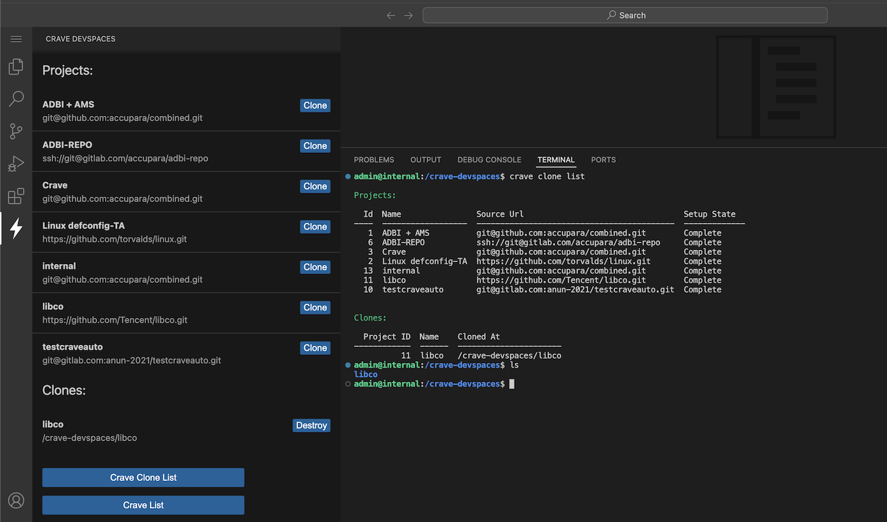

## Crave Devspaces VSCode Extension

### Simplify accessing Crave Devspaces through VSCode

The extension allows Crave Devspace users to manage their project clones.

1. `crave clone list`: To list user projects & clones
2. `crave clone create --projectID <id> <destination-dir>`: To clone a project inside a destination dir
3. `crave clone destroy <destination-dir>`: To destroy the already create clone

 

